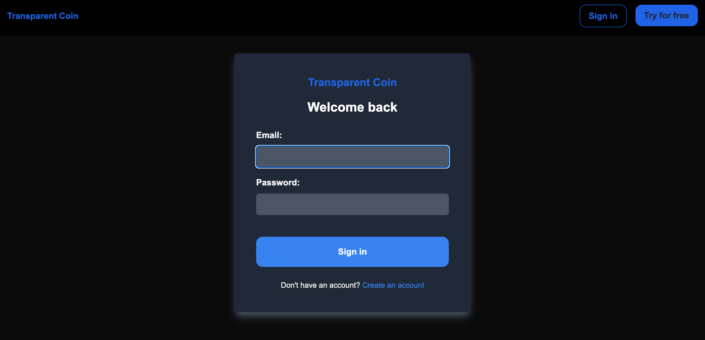
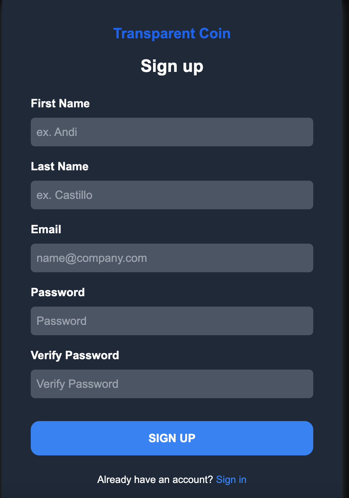
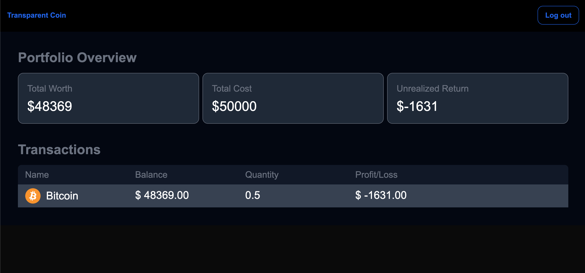
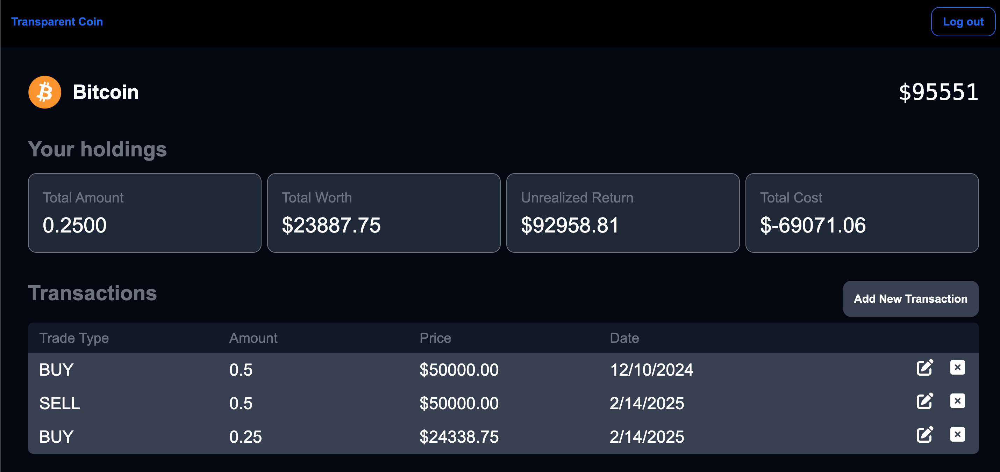
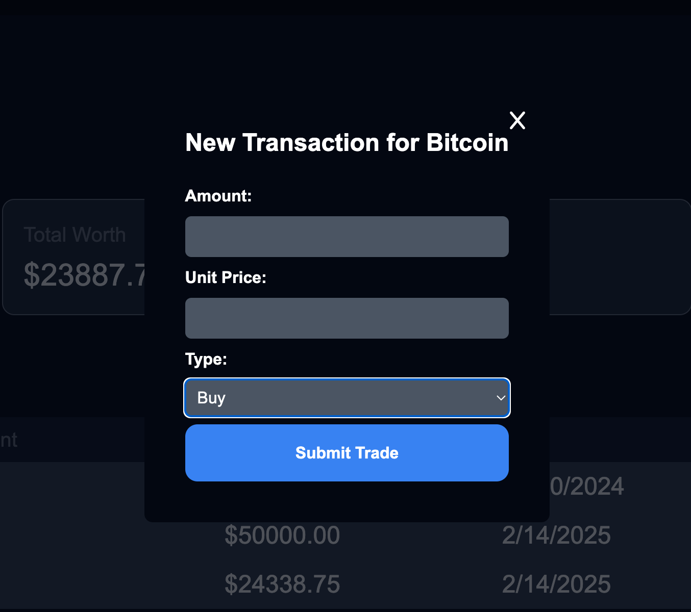

This is a [Next.js](https://nextjs.org) project bootstrapped with [`create-next-app`](https://nextjs.org/docs/app/api-reference/cli/create-next-app).

## Project Screenshots

Below are some screenshots of the application in action:

#### Sign-in Page


#### Sign-up Page


#### Main Dashboard


#### Asset Page


#### New Transaction Page


## Getting Started

First, run the development server:

```bash
npm run dev
# or
yarn dev
# or
pnpm dev
# or
bun dev
